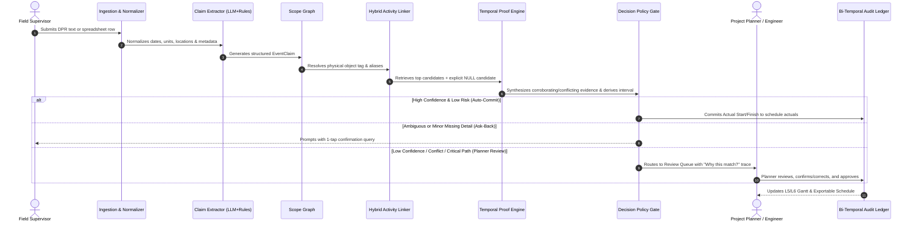

# 🏗️ KARMSETU (कर्मसेतु)
### *The field speaks. The plan listens.*
**EVIDENCE-FIRST PLANNING-TO-EXECUTION BRIDGE**

[](https://www.sih.gov.in/)
[](https://www.sih.gov.in/)
[](#)
[](#)
[](#)

---

## 🎯 Core Proposition

> **From *"What date did they report?"* to *"What can we prove happened?"***
>
> KarmSetu connects fragmented field evidence to defensible Level 5/Level 6 (L5/L6) schedule actuals, while keeping human reviewers firmly in control of ambiguity, temporal precision, and schedule risk.

---

## ⚡ Quick Start & Local Execution

### Prerequisites
- **Node.js**: v18+ or v20+ recommended
- **npm**: v9+

### Installation & Launch
```bash
# 1. Clone repository (or navigate to workspace)
cd KarmSetu

# 2. Install dependencies
npm install

# 3. Launch Vite development server
npm run dev
```

The application will start locally at:
👉 **[http://localhost:5173](http://localhost:5173)**

### Build for Production
```bash
npm run build
npm run preview
```

---

## 🧭 Repository Structure

```plaintext
KarmSetu/
├── index.html                   # Entry HTML with custom typography and viewport configuration
├── vite.config.ts               # Vite bundler configuration (React + Tailwind plugins)
├── package.json                 # Project dependencies and NPM scripts
├── src/
│   ├── main.tsx                 # React application bootstrap
│   ├── App.tsx                  # Global Router, Layout, and Navigation
│   ├── index.css                # Global Design System tokens, animations, and Tailwind imports
│   ├── types/                   # Strongly typed contracts (Claims, Evidence, Schedule, Decisions)
│   ├── store/                   # State management (Zustand stores for claims, schedule, review)
│   ├── mocks/                   # Synthetic L5/L6 dataset (150+ activities, aliases, DPR text, spreadsheets)
│   ├── components/              # Shared UI components (Gantt visualizers, Evidence trees, Hash checkers)
│   └── pages/                   # Application views
│       ├── DashboardPage.tsx       # Executive overview & real-time progress KPIs
│       ├── IngestPage.tsx          # Multi-format field ingestion (DPR text & CSV spreadsheets)
│       ├── ClaimsPage.tsx          # Structured event claims extraction view
│       ├── ScopeGraphPage.tsx      # Object hierarchy & physical scope resolution
│       ├── ActivityTracePage.tsx   # Detailed match rationale & "Why this match?" evidence trail
│       ├── ReviewQueuePage.tsx     # 3-Lane Decision Policy (Auto-Commit, Ask-Back, Planner Review)
│       ├── TodaysBoardPage.tsx     # Field supervisor daily lookahead & readiness board
│       ├── GanttPage.tsx           # Schedule actuals & baseline comparison (L5/L6 Gantt)
│       ├── TimeAgentPage.tsx       # Temporal proof engine & interval derivation inspector
│       ├── AuditLedgerPage.tsx     # Bi-temporal SHA-256 tamper-evident audit ledger
│       ├── ExecutionMemoryPage.tsx # Institutional memory & verified site vernacular
│       ├── WritebackPage.tsx       # Export pipeline for CSV / XER schedule actuals
│       ├── DataQualityPage.tsx     # Evidence freshness, completeness & conflict analytics
│       ├── PipelineDemoPage.tsx    # Interactive end-to-end sandbox (Happy, Ambiguous, Unmatched)
│       └── SystemHealthPage.tsx    # Processing pipeline status & latency diagnostics
```

---

---

## 1. Executive Summary

**KarmSetu** is an evidence-first planning-to-execution bridge for mega-infrastructure projects. It is designed to help project management offices (PMOs) convert fragmented execution signals—such as daily progress reports (DPRs), discipline spreadsheets, site diaries, supervisor messages, permits, material updates, inspection records, and equipment logs—into traceable actual-progress events linked directly to Level 5/Level 6 (L5/L6) schedule activities.

### The Core Problem
The underlying issue is not simply that field data is unstructured. The deeper problem is that **field language, physical scope, schedule terminology, evidence quality, and time constraints do not naturally line up**.
- A report stating *"spool 3 and 4 erected"* refers to physical objects or groups of spools, whereas the master schedule defines a formal activity description, WBS code, and ID.
- A language model can extract a claim, but an LLM **should never be trusted to unilaterally decide that a schedule activity is complete**.

### The KarmSetu Architecture
KarmSetu rigorously separates **extraction** from **decision-making**:
1. **AI / NLP** interprets incoming narrative reports into structured claims.
2. A **Scope Graph** resolves the physical object identity (tag, alias, line, area).
3. A **Hybrid Linker** retrieves candidate schedule activities (including an explicit `NULL` / Unmatched option).
4. An **Evidence Graph** corroborates or flags conflicting signals across operational data (permits, materials, inspections).
5. A **Temporal Proof Engine** derives a defensible date or time interval under constraints.
6. A **Decision Policy Engine** determines whether to auto-commit, ask for one-tap clarification, or escalate to a planner.

Every proposed or accepted update retains a human-readable **Why this match?** trace explaining what evidence supported it and what was known at the time.

### Positioning Statement
> **KarmSetu does not replace Primavera P6, Microsoft Project, or an organization's existing PMIS.**
> It acts as an intelligent, trust-preserving verification bridge around existing planning systems, reconciling raw field reality with master schedules and generating validated actuals in industry-standard formats (CSV / XER).

---

## 2. Problem Understanding

### 2.1 The Operating Context
Infrastructure schedules cascade from executive milestones (L1/L2) down to detailed L5/L6 activities across civil works, piping, static and rotating equipment, electrical, instrumentation, and HSE. The schedule provides a formal plan, but execution evidence is generated by diverse field crews using divergent formats and vocabularies:

```
[Level 1-2: Executive Milestones]
       ↓
[Level 3-4: Work Packages / Disciplines]
       ↓
[Level 5-6: Detailed Physical Activities]  ←─── [KarmSetu Reconciles] ───→ [Fragmented Field Signals]
  - Formal Activity IDs & WBS Codes                                          - Free-text DPRs & Site Diaries
  - Predecessor/Successor Logic                                              - Discipline CSV/XLSX Sheets
  - Strict Granularity Rules                                                 - WhatsApp/Telegram Messages
                                                                             - Permits to Work (PTW) & Crane Logs
```

- **Vocabulary Mismatch**: Field teams use vernacular tags (`"P-204"`, `"Pump skid B"`), while schedules use formal descriptions (`"Erect Centrifugal Slurry Pump 10-P-204B on Foundation F-12"`).
- **Ambiguity**: The phrase *"pump installed"* could refer to multiple physical units, locations, or sub-activities.
- **Temporal Uncertainty**: Reported dates are frequently retrospective, weekend-aggregated, or more precise than the underlying evidence supports (e.g., claiming complete on the 14th when inspection was only verified on the 16th).
- **Manual Reconciliation Drag**: Schedulers spend up to 40% of their time manually calling site engineers, reconciling spreadsheets, and entering dates, leading to delayed reporting and stale progress analytics.
- **Loss of Institutional Memory**: Reasons for site delays, workarounds, and site aliases vanish at project closeout.

### 2.2 What Problem Statement 26122 Requires
- **Heterogeneous Ingestion**: Ingest multiple field formats (DPR text, spreadsheets) alongside Primavera P6 / MS Project exports.
- **Event Extraction**: Extract activity-level actual-start and actual-end events from narrative text and tabular rows.
- **Fuzzy / Semantic Matching**: Link field terminology to L5/L6 activities across granularity mismatches.
- **Confidence & Human-in-the-Loop**: Expose matching confidence and provide intuitive verification workflows for uncertain cases.
- **Real-Time Audit Trail**: Maintain near-real-time schedule-linked actuals with a tamper-evident audit history.
- **Structured Progress Data**: Produce discipline-tagged data supporting lookahead readiness, bottleneck detection, and institutional memory.

*Note on prototype scope*: The problem statement explicitly permits demonstrating 2–3 varied formats, noting that production-grade OCR/ASR is not required for the initial demonstration. KarmSetu prioritizes a rock-solid, verifiable end-to-end workflow over a superficial prototype.

---

## 3. Proposed Solution

### 3.1 The KarmSetu Workflow: CAPTURE → CONNECT → PROVE → ACT

```
 ┌────────────────┐     ┌────────────────┐     ┌────────────────┐     ┌────────────────┐
 │    CAPTURE     │ ──► │    CONNECT     │ ──► │     PROVE      │ ──► │      ACT       │
 └────────────────┘     └────────────────┘     └────────────────┘     └────────────────┘
   Ingest DPR text,       Resolve physical       Synthesize evidence,   Three-Lane Action:
   spreadsheets &         scope & retrieve       temporal bounds &      Auto-commit,
   schedule exports.      L5/L6 candidates.      evidence grades.       Ask-back, Review.
```

| Stage | Purpose | Example Output |
| :--- | :--- | :--- |
| **CAPTURE** | Ingest field reports, spreadsheets, schedule exports, and operational records. | Source ID, raw text/row, reporter role, ingestion timestamp, discipline tag. |
| **CONNECT** | Resolve physical objects via Scope Graph and link claims to candidate schedule activities. | Object entity ID, ranked activity candidates, lexical/semantic match rationale, `NULL` flag. |
| **PROVE** | Combine evidence and temporal constraints to estimate what can be asserted safely. | Defensible date or interval (e.g., `[2026-08-13, 2026-08-14]`), Evidence Grade (`A/B/C`), conflicts. |
| **ACT** | Commit to schedule actuals, ask targeted follow-up questions, or route to human planner. | Updated L5/L6 actuals, audit ledger entry with SHA-256 hash, next lookahead readiness action. |

### 3.2 End-to-End User Journey



### 3.3 Illustrative Walkthrough
**Field Input:**
> *"Spool P204-07 erection completed. Welding for Section B started."*

1. **Claim Extraction**:
   - Claim 1: Object `Spool P204-07`, Event `ERECTION_COMPLETE`, Status `COMPLETED`, Date `2026-08-14`.
   - Claim 2: Object `Section B`, Event `WELDING_START`, Status `IN_PROGRESS`, Date `2026-08-14`.
2. **Scope Resolution**:
   - `Spool P204-07` is resolved to Line `10-P-204-A1`, Area `Utility Yard`, System `Cooling Water`.
3. **Candidate Linking**:
   - Top candidate: `ACT-PIP-1048` (*"Erect Pre-fabricated Spools Line 10-P-204 Area UY"*), Score `0.94`.
4. **Evidence Synthesis**:
   - Crane release log confirms crane demobilized 13 Aug 18:00.
   - Material issue slip confirmed 12 Aug.
   - QC NDT report has not yet been logged.
5. **Temporal Derivation**:
   - Bounded completion interval: `[2026-08-13 18:00, 2026-08-14 11:00]`. Evidence Grade: **B+**.
6. **Decision**:
   - Predecessor dependency satisfied. Routed to Planner with one-click verification.
---

## 4. Core Innovation and Differentiation

KarmSetu’s differentiation is not the presence of an LLM, a chatbot, OCR, or a Gantt chart. Those are enabling utilities. **The innovation is the evidence-and-decision layer that governs what the system is allowed to write to a schedule, why it is allowed to do so, and what it must do when evidence is incomplete or contradictory.**

```
┌─────────────────────────────────────────────────────────────────────────────┐
│                           THE KARMSETU CORE ENGINE                          │
├─────────────────────────┬─────────────────────────┬─────────────────────────┤
│  Proof-Bounded Actuals  │       Scope Graph       │     Evidence Graph      │
│  Intervals, not false   │  Object-first physical  │  Corroboration &        │
│  point precision        │  resolution before text │  conflict synthesis     │
├─────────────────────────┼─────────────────────────┼─────────────────────────┤
│      Blocking Web       │    Execution Memory     │    Report-to-Receive    │
│  Real-world constraint  │  Preserves vernacular & │  Immediate field value  │
│  causality tracking     │  historical durations   │  for reporting progress │
└─────────────────────────┴─────────────────────────┴─────────────────────────┘
```

| Innovation | What It Means | Why It Matters |
| :--- | :--- | :--- |
| **1. Proof-Bounded Actuals** | Represents schedule actuals as a bounded time interval (`t_start` to `t_end`) paired with an **Evidence Grade** (`A/B/C`) and derivation record. | Prevents false certainty and audit disputes when field logs only corroborate a 2-day execution window. |
| **2. Scope Graph** | Decouples the physical world (Area → System → Equipment → Spool → Joint) from schedule wording before attempting activity matching. | Eliminates errors caused by granularity mismatches and informal field shorthand. |
| **3. Evidence Graph** | Interlinks claims with independent operational signals (permits, store issuances, equipment telemetry, inspection logs). | Makes corroboration obvious and flags physical impossibilities (e.g., spool erected before crane arrived). |
| **4. Blocking Web** | Models real-world physical and operational prerequisites (access, permits, weather, inspections), not just CPM finish-to-start logic. | Explains *why* an activity is blocked and pinpoints the exact prerequisite needed to unlock it. |
| **5. Execution Memory** | Automatically archives verified site aliases, empirical duration distributions, and past delay patterns upon planner approval. | Transforms project closeout data into an institutional knowledge base for future planning cycles. |
| **6. Report-to-Receive** | Returns instant operational value to the reporting supervisor (e.g., tomorrow's readiness checklist, open blockers). | Motivates field supervisors to submit timely, high-fidelity daily reports. |

### Supporting Mechanisms
- **Site Vernacular Memory**: Stores validated field aliases (`"big pump" → "10-P-204B"`) only after explicit human planner approval.
- **Delay Dossier**: Packages baseline schedule dates, actual interval, source evidence, active blockers, and schedule variance into an audit-ready dossier.
- **Bi-Temporal History**: Distinguishes **Event-Time** (when the work occurred) from **Known-At Time** (when the system recorded it).
- **Tamper-Evident Audit**: Uses a cryptographic SHA-256 hash chain (`Hash_i = SHA256(Payload_i + Hash_{i-1})`) to guarantee traceability.
- **Explicit NULL Candidate**: If no schedule activity matches the reported scope, the system marks the claim `UNMATCHED` instead of forcing a false match.

### The Core Design Principle
> ### 🛡️ **AI extracts. Deterministic engines decide. Humans govern exceptions.**
> The language model proposes structured claims; graph resolution, matching constraints, temporal reasoning, evidence rules, and policy gates decide what can be committed. Human approval remains available wherever confidence, evidence, or project criticality requires it.

---

## 5. System Architecture

### 5.1 Logical Architecture

```
FIELD SIGNALS                                                         PLANNING BASELINE
DPR · Site Diary · Chat Messages                                    Primavera P6 / MS Project
Discipline CSV / XLSX Spreadsheets                                  XER / CSV / WBS / Dependencies
PTW · Material Issues · Crane Logs                                  Milestones & L5/L6 Activities
                 \                                                   /
                  \                                                 /
                   ▼                                               ▼
            ┌─────────────────────────────────────────────────────────────┐
            │                     CAPTURE & NORMALISE                     │
            │           Date, Unit, Location, Discipline Standardizer     │
            └─────────────────────────────────────────────────────────────┘
                                           │
                                           ▼
            ┌─────────────────────────────────────────────────────────────┐
            │                      CLAIM EXTRACTION                       │
            │          Provider-Agnostic LLM + Deterministic Regex        │
            └─────────────────────────────────────────────────────────────┘
                                           │
                                           ▼
            ┌─────────────────────────────────────────────────────────────┐
            │                         SCOPE GRAPH                         │
            │             Resolve Physical Object: "What Object?"         │
            │             Tag Hierarchy, Aliases & Asset Geometry         │
            └─────────────────────────────────────────────────────────────┘
                                           │
                                           ▼
            ┌─────────────────────────────────────────────────────────────┐
            │                   HYBRID ACTIVITY LINKER                    │
            │    Lexical (RapidFuzz/TF-IDF) + Semantic Embeddings +       │
            │    WBS Context + Predecessors + EXPLICIT NULL CANDIDATE     │
            └─────────────────────────────────────────────────────────────┘
                                           │
                                           ▼
            ┌─────────────────────────────────────────────────────────────┐
            │                       EVIDENCE GRAPH                        │
            │   Corroborating & Conflicting Multi-Source Signal Synthesis │
            └─────────────────────────────────────────────────────────────┘
                                           │
                                           ▼
            ┌─────────────────────────────────────────────────────────────┐
            │                    TEMPORAL PROOF ENGINE                    │
            │      Derives Defensible Intervals & Assigns Evidence Grade  │
            └─────────────────────────────────────────────────────────────┘
                                           │
                       ┌───────────────────┴───────────────────┐
                       ▼                                       ▼
            ┌───────────────────────┐               ┌───────────────────┐
            │ PROOF-BOUNDED ACTUALS │               │   BLOCKING WEB    │
            │ Interval & Derivation │               │ & READINESS LOGIC │
            └───────────────────────┘               └───────────────────┘
                       │                                       │
                       └───────────────────┬───────────────────┘
                                           ▼
            ┌─────────────────────────────────────────────────────────────┐
            │                    DECISION POLICY GATE                     │
            │         AUTO-COMMIT    │   ASK-BACK   │   PLANNER REVIEW    │
            └─────────────────────────────────────────────────────────────┘
                                           │
                                           ▼
            ┌─────────────────────────────────────────────────────────────┐
            │                  BI-TEMPORAL AUDIT LEDGER                   │
            │         SHA-256 Hash Chaining · Event Time vs Known-At      │
            └─────────────────────────────────────────────────────────────┘
                                           │
                ┌──────────────────────────┼──────────────────────────┐
                ▼                          ▼                          ▼
     ┌──────────────────────┐   ┌──────────────────────┐   ┌──────────────────────┐
     │     L5/L6 GANTT      │   │   3-DAY LOOKAHEAD    │   │    DELAY DOSSIER     │
     │   Progress Tracker   │   │  Site Readiness View │   │  Root-Cause & Proof  │
     └──────────────────────┘   └──────────────────────┘   └──────────────────────┘
                │                          │                          │
                ▼                          ▼                          ▼
     ┌──────────────────────┐   ┌──────────────────────┐   ┌──────────────────────┐
     │    CSV / XER EXPORT  │   │  REPORT-TO-RECEIVE   │   │   EXECUTION MEMORY   │
     │ Schedule Write-back  │   │ Supervisor Feedback  │   │ Vernacular & Lessons │
     └──────────────────────┘   └──────────────────────┘   └──────────────────────┘
```

### 5.2 Component Responsibilities & Trust Boundaries

| Component | Responsibility | Trust Boundary |
| :--- | :--- | :--- |
| **Ingestion Adapters** | Parse DPR text, CSV/XLSX spreadsheets, and schedule exports. | Preserves original source records and file metadata immutably. |
| **Normalizer** | Standardizes date formats, metric/imperial units, discipline tags, and locations. | Retains raw values alongside normalized counterparts. |
| **Claim Extractor** | Generates typed event claims (`object`, `event_type`, `status`, `dates`). | **Untrusted Proposal**: Model outputs cannot write directly to schedule. |
| **Scope Graph** | Resolves equipment tags, aliases, hierarchy, and system boundaries. | Exposes unresolved ambiguity and competing object candidates. |
| **Activity Linker** | Ranks candidate schedule activities using multi-signal scoring. | Includes mandatory `NULL` candidate to prevent forced matches. |
| **Evidence Graph** | Links claims to corroborating/conflicting records (PTW, stores, logs). | Assesses multi-source provenance and timestamp freshness. |
| **Temporal Proof Engine**| Derives mathematically sound date bounds under physical constraints. | Prohibits inventing unsupported temporal precision. |
| **Decision Policy Gate**| Enforces policy thresholds to assign claims to Auto-Commit, Ask-Back, or Review. | Hard-coded policy rules govern all schedule write operations. |
| **Audit Ledger** | Maintains bi-temporal history and SHA-256 tamper-evident hash chaining. | Prevents silent overwrites; every modification creates a new revision. |
| **Presentation / Export**| Delivers interactive UI (Gantt, Review Queue, Lookahead, Export). | Clearly delineates proposed, verified, and rejected actuals. |

---

## 6. Technical Stack

| Layer | Proposed Technology | Role in Prototype | Why Selected |
| :--- | :--- | :--- | :--- |
| **Frontend** | **React 19 + TypeScript + Vite** | Responsive single-page application for ingestion, review, and progress analytics. | Sub-millisecond HMR, type safety, rich component ecosystem, and rapid prototyping speed. |
| **Styling** | **Tailwind CSS v4 + Vanilla CSS** | Curated dark/light theme, modern glassmorphism, responsive data grids. | Zero-runtime CSS, consistent token spacing, and modern design aesthetics. |
| **State Management**| **Zustand** | Centralized reactive stores for claims, schedule, review queue, and audit ledger. | Lightweight, boilerplate-free state management with zero provider wrapping overhead. |
| **Icons & Charts** | **Lucide React + Recharts** | High-density data dashboards, schedule S-curves, and intuitive iconography. | Clean SVG rendering, accessible interactive tooltips, and customizable layouts. |
| **Backend API** | **Python 3.11 + FastAPI** | High-performance REST endpoints for ingestion, graph resolution, and writeback. | Native async support, automatic OpenAPI/Swagger docs, and rapid Python data handling. |
| **Data Validation** | **Pydantic v2** | Strict validation of claims, evidence structures, and decision schemas. | Ultra-fast Rust-based data validation and predictable JSON serialization. |
| **Database & ORM** | **PostgreSQL 16 + SQLAlchemy** *(SQLite Fallback)* | Relational persistence of schedules, scope objects, evidence graphs, and ledger. | Robust relational integrity, JSONB support for unstructured evidence, and seamless fallback. |
| **Lexical Matcher** | **RapidFuzz + scikit-learn TF-IDF** | Token-ratio, Levenshtein, and TF-IDF n-gram candidate activity retrieval. | Fast, CPU-friendly baseline with zero GPU dependency and 100% transparent scoring. |
| **Semantic Retrieval**| **Sentence-Transformers** *(Optional)* | Embeddings for capturing semantic synonyms (e.g., *"erect"* vs *"install"*). | Handles cross-vocabulary retrieval when lexical matching falls below threshold. |
| **AI Extraction** | **Provider-Agnostic LLM Adapter** | Translates free-text field narratives into structured Pydantic claims. | Avoids vendor lock-in (compatible with Gemini, OpenAI, Claude, or local Ollama). |
| **Security & Auth** | **JWT + RBAC** | Enforces role boundaries: Field Reporter, Planning Engineer, Project Manager. | Prevents unauthorized schedule commitments and maintains strict user provenance. |
| **Data Integrity** | **SHA-256 Hash Chaining** | Tamper-evident chaining of audit events for all confirmed progress updates. | Cryptographically verifiable history for contract disputes and statutory audits. |

---

## 7. Data Model and Decision Logic

### 7.1 Core Entity Schema

```
┌──────────────────┐       ┌──────────────────┐       ┌──────────────────┐
│   SourceRecord   │──────►│    EventClaim    │──────►│  ScopeResolution │
│ (File, Reporter) │       │ (Extracted Event)│       │  (Object ID/Tag) │
└──────────────────┘       └──────────────────┘       └──────────────────┘
                                    │                           │
                                    ▼                           ▼
                           ┌──────────────────┐       ┌──────────────────┐
                           │   EvidenceItem   │       │ActivityCandidate │
                           │ (PTW, Crane, NDT)│       │(Ranked L5/L6 IDs)│
                           └──────────────────┘       └──────────────────┘
                                    │                           │
                                    └─────────────┬─────────────┘
                                                  ▼
                                       ┌──────────────────┐
                                       │   ProofResult    │
                                       │(Interval & Grade)│
                                       └──────────────────┘
                                                  │
                                                  ▼
                                       ┌──────────────────┐
                                       │  DecisionRecord  │
                                       │(Lane, User, Note)│
                                       └──────────────────┘
                                                  │
                                                  ▼
                                       ┌──────────────────┐
                                       │    AuditEvent    │
                                       │ (SHA-256 Chained)│
                                       └──────────────────┘
```

| Entity | Primary Attributes | Purpose |
| :--- | :--- | :--- |
| `ScheduleActivity` | `activity_id`, `wbs`, `description`, `discipline`, `planned_start`, `planned_finish`, `actual_start`, `actual_finish`, `predecessors`, `is_critical` | Formal master schedule activity entity. |
| `ScopeObject` | `object_id`, `tag`, `object_type`, `parent_id`, `aliases`, `discipline`, `system`, `area` | Physical infrastructure asset independent of schedule terminology. |
| `SourceRecord` | `source_id`, `source_type` (DPR/CSV), `raw_content`, `reporter_id`, `event_time`, `received_at`, `file_hash` | Raw source record preserving complete provenance. |
| `EventClaim` | `claim_id`, `source_id`, `object_mention`, `event_type`, `status`, `quantity`, `date_bounds`, `source_span` | Structured semantic interpretation of a field narrative statement. |
| `EvidenceItem` | `evidence_id`, `source_id`, `evidence_type` (PTW/Store/Inspection), `payload`, `timestamp`, `relevance` | Corroborating or contradictory physical execution signal. |
| `ActivityCandidate`| `claim_id`, `activity_id` (or `NULL`), `rank`, `feature_scores` (lexical, semantic, WBS), `explanation` | Ranked candidate schedule activities with match rationale. |
| `ProofResult` | `claim_id`, `interval_start`, `interval_finish`, `evidence_grade` (`A/B/C`), `conflicts`, `derivation_summary` | Synthesized temporal bounds and evidence reliability assessment. |
| `DecisionRecord` | `decision_id`, `claim_id`, `action_lane` (`AUTO_COMMIT`/`ASK_BACK`/`REVIEW`), `accepted_activity_id`, `reviewer_id`, `created_at` | Formal governance action applied to the claim. |
| `AuditEvent` | `event_id`, `previous_hash`, `current_hash`, `actor_id`, `event_time`, `known_at`, `action_payload` | Tamper-evident bi-temporal audit log. |

### 7.2 Hybrid Matching Scoring Logic
Rather than relying on a single opaque embedding similarity score, KarmSetu computes a transparent composite feature vector:

$$\text{Composite Score} = w_1 \cdot S_{\text{lexical}} + w_2 \cdot S_{\text{semantic}} + w_3 \cdot S_{\text{object}} + w_4 \cdot S_{\text{discipline}} + w_5 \cdot S_{\text{predecessor}} + w_6 \cdot S_{\text{temporal}}$$

- $S_{\text{lexical}}$: Token sort ratio, partial token ratio, and Levenshtein distance.
- $S_{\text{semantic}}$: Cosine similarity of dense vector embeddings.
- $S_{\text{object}}$: Exact or alias match from the Scope Graph hierarchy.
- $S_{\text{discipline}}$: 1.0 if discipline tags match; 0.0 if conflicting.
- $S_{\text{predecessor}}$: 1.0 if CPM predecessor activities have been marked complete.
- $S_{\text{temporal}}$: Compatibility of reported event date with project calendar and planned window.

*The explicit `NULL` candidate is scored dynamically. If no candidate exceeds the minimum confidence threshold, `NULL` ranks first.*

### 7.3 Evidence Grades and Temporal Intervals

```
                  EVIDENCE GRADE CLASSIFICATION
 ┌─────────────────┬─────────────────────────────────────────────────┐
 │ Grade A (High)  │ Direct dated field claim + 2 independent        │
 │                 │ corroborating signals (e.g., DPR + PTW + NDT).  │
 ├─────────────────┼─────────────────────────────────────────────────┤
 │ Grade B (Medium)│ Credible supervisor log + 1 secondary signal    │
 │                 │ OR single source with bounded temporal range.   │
 ├─────────────────┼─────────────────────────────────────────────────┤
 │ Grade C (Low)   │ Uncorroborated narrative claim, contradictory   │
 │                 │ dates, or missing mandatory inspection slip.    │
 └─────────────────┴─────────────────────────────────────────────────┘
```

### 7.4 The Three Decision Lanes

```
                              ┌────────────────────┐
                              │  Synthesized Claim │
                              └─────────┬──────────┘
                                        │
                         Confidence ≥ 0.90 & Grade A &
                         Non-Critical Path & Zero Conflicts?
                                   /         \
                             YES  /           \  NO
                                 ▼             ▼
                    ┌─────────────────┐   Ambiguous object or missing
                    │   AUTO-COMMIT   │   single parameter?
                    │ Schedule actual │            /         \
                    │ updated instantly│     YES  /           \  NO
                    └─────────────────┘          ▼             ▼
                                        ┌─────────────────┐   ┌─────────────────┐
                                        │    ASK-BACK     │   │ PLANNER REVIEW  │
                                        │ 1-Tap Field     │   │ Human planner   │
                                        │ Confirmation UI │   │ inspects evidence│
                                        └─────────────────┘   └─────────────────┘
```

1. **AUTO-COMMIT**: Low-risk non-critical activities with high-confidence object matches, Grade A corroboration, and complete predecessor satisfaction.
2. **ASK-BACK / ONE-TAP**: System has identified 1–2 plausible interpretations and issues a targeted clarification question directly to the reporting supervisor.
3. **PLANNER REVIEW**: Default lane for all critical-path activities, safety/inspection hold points, conflicting dates, or low-confidence matches.

---

---

## 8. Demo Plan

The demonstration is organized around three distinct operational scenarios that prove the system's ability to act safely under real site conditions:

### 8.1 Scenario 1: The Happy Path (Corroborated Match)
1. **Input**:
   ```text
   "Spool P204-07 erection completed. Welding for Section B started."
   ```
2. **System Behavior**:
   - Extracts two distinct claims.
   - Scope Graph resolves `Spool P204-07` to Line `10-P-204-A1` in the Utility Yard.
   - Links to activity `ACT-PIP-1048` with 94% composite confidence.
   - Corroborates crane release log (demobilized 13 Aug) and material gate pass.
   - Derives interval `[2026-08-13 18:00, 2026-08-14 11:00]` with Evidence Grade **A**.
   - Displays transparent *"Why this match?"* breakdown.
   - Planner approves; L5/L6 Gantt view updates instantly with verifiable green status badge.
   - Demonstrates bi-temporal audit log showing SHA-256 hash chaining.

### 8.2 Scenario 2: The Ambiguous Case (Safe Non-Update & Ask-Back)
1. **Input**:
   ```text
   "Pump installation completed."
   ```
2. **System Behavior**:
   - Scope Graph identifies three candidate pumps (`10-P-201`, `10-P-204A`, `10-P-204B`).
   - Matcher refuses to guess and triggers **ASK-BACK** lane.
   - Generates a targeted, one-tap mobile prompt:
     > *"Which pump was installed? [10-P-201] [10-P-204A] [10-P-204B]"*
   - Highlights the safety principle: **Ambiguity is treated as a first-class decision, not hidden behind an unearned confidence score.**

### 8.3 Scenario 3: The Unmatched Case (Schedule-Gap Detection)
1. **Input**:
   ```text
   "Constructed 250m temporary gravel access road along northern perimeter."
   ```
2. **System Behavior**:
   - Hybrid linker scans all 150 activities; highest score is 0.31 (below threshold).
   - Candidate `NULL (Unmatched)` ranks first.
   - System registers an **Unmatched Field Claim** and creates a **Schedule-Gap Notice**.
   - Alerts the PMO that physical work is consuming resources without an assigned WBS code.

---

## 9. Evaluation, Testing, and Risk Controls

### 9.1 Evaluation Metrics

| Area | Key Metric | Why It Matters |
| :--- | :--- | :--- |
| **Safety** | **False Auto-Update Rate (FAUR)** | Percentage of automated schedule updates that commit an erroneous date or activity. Must approach 0.0% in high-trust environments. |
| **Activity Linking** | **Top-1 / Top-3 Accuracy & F1** | Measures precision in mapping site descriptions to formal L5/L6 schedule activities. |
| **Safe Abstention** | **Unmatched Recall (NULL Detection)** | Verifies that out-of-scope work is safely rejected rather than forced into unrelated activities. |
| **Temporal Rigor** | **Unsupported Precision Rate** | Measures how often the system flags or prevents inventing point timestamps when evidence only supports a date range. |
| **Human Efficiency** | **Planner Review Velocity** | Reduction in hours spent by planners manually reconciling spreadsheets and calling site supervisors. |
| **System Integrity** | **Audit Completeness** | 100% of committed updates must trace back to raw source inputs, actor IDs, and cryptographic hashes. |

### 9.2 Validation Approach
- **Pre-Seeded Synthetic Benchmark**: 100 labeled test claims containing standard field reports, spelling errors, jargon aliases, ambiguous equipment names, and hard negatives.
- **Held-Out Test Set**: Evaluation performed on test scenarios never seen during prompt engineering or alias dictionary tuning.
- **Independent Dual-Review**: Benchmarking against gold-standard manual planner reconciliations.

### 9.3 Key Risks & Mitigations

| Identified Risk | Potential Impact | KarmSetu Mitigation Mechanism |
| :--- | :--- | :--- |
| **Incorrect Activity Link** | Corrupts schedule logic, distorts float calculations, and invalidates lookaheads. | Scope Graph physical resolution, multi-feature ranking, explicit `NULL` option, and Planner Review lane. |
| **Unsupported Date Precision** | False certainty in delay claims and contractual liquidated damages disputes. | Bounded temporal intervals, explicit evidence grading, and strict provenance records. |
| **Conflicting Field Signals** | Disputed progress claims between subcontractors and site supervisors. | Multi-source Evidence Graph with automated contradiction flags; stops auto-commit on conflict. |
| **Site Vernacular Drift** | Accuracy degrades as field crews introduce idiosyncratic site jargon. | Supervised Vernacular Memory: project-specific aliases require planner approval before joining the dictionary. |
| **LLM Hallucinations** | System invents nonexistent equipment tags, quantities, or event dates. | Pydantic typed schema validation, source text span grounding, and deterministic validation gates. |
| **Silent Schedule Overwrites** | Unaudited manual adjustments erase historical progress records. | Append-only bi-temporal audit ledger with SHA-256 hash chaining. |

---

## 10. Practicality and User Value

```
┌─────────────────────────────────────────────────────────────────────────────┐
│                       THE "REPORT-TO-RECEIVE" LOOP                          │
├─────────────────────────────────────────────────────────────────────────────┤
│                                                                             │
│     Field Supervisor                    KarmSetu Engine                     │
│   ┌──────────────────┐               ┌──────────────────┐                   │
│   │ Submits DPR Text │ ────────────► │ Ingests, Links & │                   │
│   │ or Site Log      │               │ Synthesizes Data │                   │
│   └──────────────────┘               └────────┬─────────┘                   │
│            ▲                                  │                             │
│            │ Immediate Operational Value      │                             │
│            └──────────────────────────────────┘                             │
│             - Tomorrow's 3-Day Lookahead Checklist                          │
│             - Active Permit & Material Blocker Alerts                       │
│             - Instant Acknowledgment & Clarification Prompts                │
│                                                                             │
└─────────────────────────────────────────────────────────────────────────────┘
```

### User Value by Role

| User Persona | Key Pain Point | KarmSetu Contribution |
| :--- | :--- | :--- |
| **Field Supervisor** | Burdensome data entry, complex WBS codes, zero feedback from head office. | Submit updates in natural site language; receive instant lookahead checklists and blocker alerts. |
| **Project Planner** | 40% of time spent reconciling spreadsheets, missing proof, disputable actuals. | Curated Review Queue with complete evidence provenance, one-click approvals, and verified intervals. |
| **Project Director / PMO**| Stale progress dashboards, unexpected critical path delays, lack of auditability. | Near-real-time schedule actuals, transparent delay dossiers, and defensible contractor billing records. |
| **Statutory / Audit Team**| Inability to reconstruct who authorized schedule revisions during contractual disputes. | Cryptographically verifiable bi-temporal audit ledger with immutable SHA-256 hash history. |

---


## 11. Implementation Roadmap

```
  ┌─────────────────────────┐
  │  P0: SIH Prototype      │ ◄── Current Status (Interactive Demo & Sandbox)
  └────────────┬────────────┘
               ▼
  ┌─────────────────────────┐
  │  P1: Pilot Deployment   │ Field trials on controlled infrastructure packages
  └────────────┬────────────┘
               ▼
  ┌─────────────────────────┐
  │  P2: Multimodal Ingest  │ On-prem OCR & Whisper-compatible site voice notes
  └────────────┬────────────┘
               ▼
  ┌─────────────────────────┐
  │  P3: Enterprise APIs    │ Direct Primavera P6 EPPM & MS Project Server sync
  └────────────┬────────────┘
               ▼
  ┌─────────────────────────┐
  │  P4: Execution Memory   │ Cross-project empirical duration & risk forecasting
  └─────────────────────────┘
```

| Phase | Milestone | Key Deliverables & Exit Criteria |
| :--- | :--- | :--- |
| **P0: SIH Hackathon Prototype** | **Core Verifiable Loop** | Functional web application, synthetic 150-activity L6 schedule, DPR & CSV ingestion, Scope Graph, hybrid linking with `NULL`, Evidence Graph, 3 decision lanes, bi-temporal audit ledger, and CSV export. |
| **P1: Pilot Deployment** | **Controlled Field Trial** | Role-based authentication (RBAC), multi-user concurrency, configurable policy thresholds, supervised vernacular memory curation, and planner-in-the-loop pilot testing on non-critical packages. |
| **P2: Multimodal Ingestion** | **Expanded Formats** | Edge OCR adapter for scanned paper site diaries, on-device Whisper speech-to-text for field voice notes, and multilingual support for regional site languages. |
| **P3: Enterprise Integration** | **Production PMIS Sync** | Certified Primavera P6 SDK / Web Services API adapter, Microsoft Project Server sync, SAP / Oracle ERP material integration, and automated enterprise SSO. |
| **P4: Execution Memory** | **Institutional AI** | Cross-project empirical duration distributions, subcontractor reliability benchmarking, automated delay dossier generation, and predictive schedule risk analytics. |

---


## 12. Success Criteria and Deliverables

### 12.1 P0 Deliverables Checklist
- [x] **Synthetic L5/L6 Infrastructure Schedule**: 150+ activities, complete WBS hierarchy, dependencies, and baseline dates.
- [x] **Multi-Format Ingestion Engine**: DPR narrative text parser and tabular CSV discipline spreadsheet importer.
- [x] **Scope Graph Visualizer**: Physical scope hierarchy linking areas, systems, lines, and tagged assets.
- [x] **Hybrid Activity Linker**: Multi-feature scoring (lexical + semantic + context + explicit `NULL` option).
- [x] **Evidence & Temporal Proof Engine**: Multi-source corroboration graph, interval bounds derivation, and Evidence Grades.
- [x] **3-Lane Decision System**: Auto-Commit, 1-Tap Ask-Back, and Planner Review Queue.
- [x] **Interactive L5/L6 Gantt Tracker**: Real-time progress visualizer with baseline comparison.
- [x] **Bi-Temporal Audit Ledger**: SHA-256 chained transaction log recording Event-Time vs. Known-At Time.
- [x] **Schedule Writeback Pipeline**: Clean CSV export of validated actual start and finish dates.

### 12.2 Definition of Done (DoD)
1. An incoming DPR narrative or spreadsheet row processes end-to-end without unhandled errors or manual database edits.
2. A valid, corroborated claim updates schedule actuals with an auditable explanation.
3. An ambiguous claim triggers an Ask-Back prompt rather than an erroneous auto-commit.
4. An out-of-scope claim is flagged as `UNMATCHED` and creates a Schedule-Gap notice.
5. Every schedule write operation is cryptographically signed and chained in the audit ledger.

---

## 13. Conclusion

Infrastructure project delays rarely occur because project managers lack scheduling software; they occur because **the schedule lives in an air-conditioned site office, while reality unfolds in dust, noise, and fragmented field logs**.

KarmSetu bridges this chasm. By treating field claims as hypotheses that require corroborating proof, resolving physical objects before attempting text matching, deriving mathematically defensible intervals, and keeping human planners in control of exceptions, KarmSetu transforms chaotic site reporting into an auditable, trust-preserving asset.

> ### 🏁 **WE DON’T JUST UPDATE THE SCHEDULE. WE MAKE THE UPDATE DEFENSIBLE.**

---

## 14. References and Scope Notes

### Technical Scope Notes
1. **Problem Statement Alignment**: Designed specifically for Smart India Hackathon (SIH) 2026 Problem Statement ID **26122**: *"Intelligent Data Capture & Schedule-Linking Layer for Infrastructure Project Management: Real-Time Actual Progress Tracking (Planning-to-Execution Bridge)"*.
2. **Synthetic Data Boundaries**: All demonstration schedules, DPR logs, equipment tags, and inspection slips are synthetic constructs engineered for reproducible evaluation and benchmarking.
3. **Enterprise Integration**: Live integration with Oracle Primavera P6 EPPM and Microsoft Project Server is architected via standard XER/CSV interchange formats; live enterprise web services are scheduled for Phase P3.

### Planning & Reasoning Foundations

#### LPS / PPC / Make-Ready Planning
**Emdanat & Azambuja — Last Planner System / PPC / Near- & Long-Term Planning**  
[Lean Construction Journal](https://leanconstruction.org/lean-construction-journal/doi-info-2016-90-101/)

**Short-Horizon Readiness, Constraints & Commitments**  
[The Last Planner System of Production Control — PDF](http://lean-construction-gcs.storage.googleapis.com/wp-content/uploads/2022/09/08152942/the-last-planner-system-of-production-control-ballard2000-dissertation.pdf)

#### Temporal-Network Reasoning
**Dependency-aware reasoning under uncertain time bounds**  
[ScienceDirect — Temporal Network Research](https://www.sciencedirect.com/science/article/pii/S0890540126000210)

### Integration & Language Technology

#### Oracle Primavera P6 REST API
**Activity, WBS & schedule integration reference**  
[Oracle Primavera P6 REST API Documentation](https://docs.oracle.com/cd/F37125_01/English/Integration_Documentation/rest_api)

#### PyP6XER
**XER-oriented schedule interchange / reference**  
[PyP6XER — PyPI](https://pypi.org/project/PyP6XER/)

#### Bhashini Client SDK
**Language, speech & OCR-oriented interface for Indian-language workflows**
[AI/Bhashini-related research reference](https://ojs.aaai.org/index.php/AAAI/article/view/21213)
---
*Built with dedication by **Team LetUsCook** for Smart India Hackathon 2026.*